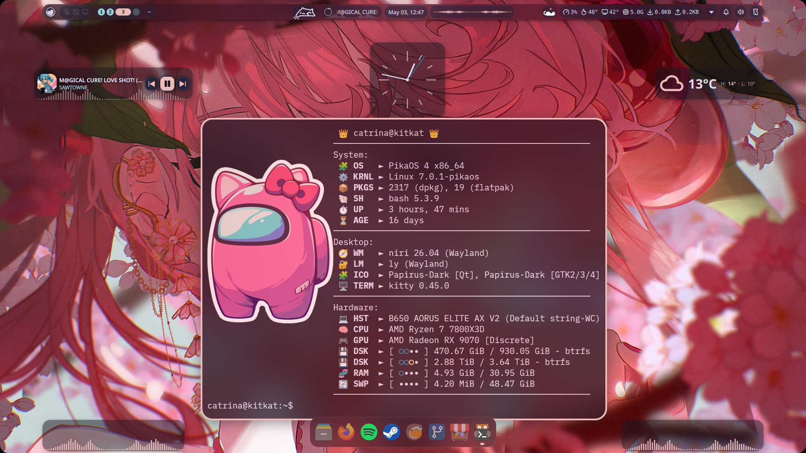

<div align="center">
ADDING THIS CAUSE INCASE I HIT MY HEAD, AND FORGET HOW TO DO STUFF
</div>
_____________________________________________________________________________________________________________________

<div align="center">
My Dot Files Are In The config Branch. Keeping 2 Branches Separated To Keep Thing's Clean And Organised.

[You Can Find Them Here](https://github.com/kitkat6464/my_configs/tree/configs)

</div>

> [!IMPORTANT]
> Install Using EndeavourOS's ISO. Use The No Desktop Option.

## Screenshots:



*KitKat's Desktop Included With Desktop Widget's Running Niri/Noctalia Shell On EndeavourOS*
_____________________________________________________________________________________________________________________

## Step 1: Install Noctalia and It's Much Needed Components:

```shell
curl -fsSL https://raw.githubusercontent.com/kitkat6464/my_configs/refs/heads/eos/NoctaliaInstaller | sh
```
_____________________________________________________________________________________________________________________

## Step 2: Install Gaming Support and It's Much Needed Components:

```shell
curl -fsSL https://raw.githubusercontent.com/kitkat6464/my_configs/refs/heads/eos/GamingAdditions | sh
```
_____________________________________________________________________________________________________________________

## Step 3: Setup Secondary Drive Access:

```shell
sudo mkdir /mnt/games
```

> [!IMPORTANT]
> Use This Command To Find Your Drive's UUID.

```shell
lsblk -f
```

> [!IMPORTANT]
> Modify fstab Very Carefully.

```shell
sudo nano /etc/fstab
```

| Example: |
|:---:|
| UUID=YOURDRIVEUUID /mnt/games     btrfs   defaults,noatime,x-gvfs-show,compress=zstd,commit=120 0 0 |

> [!IMPORTANT]
> Now Reboot Your PC.

```shell
sudo reboot
```
_____________________________________________________________________________________________________________________
