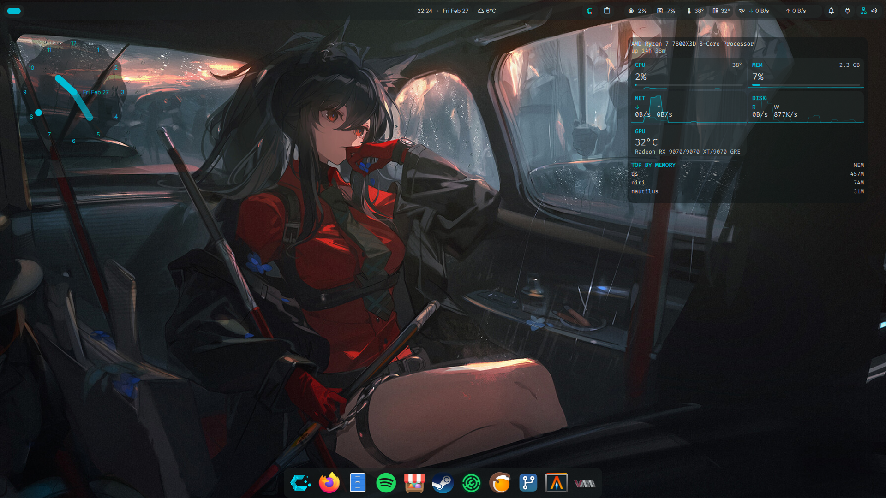

<div align="center">
ADDING THIS CAUSE INCASE I HIT MY HEAD, AND FORGET HOW TO DO STUFF
</div>

> [!TIP]
> Install Cachy Minimal Or Arch Minimal (No Desktop Option)

## Screenshots:



*KitKat's Desktop Running Niri With Dank Material Shell*

## Step 1: Install Dank Material Shell:

[Dank Shell Installation Guide](https://danklinux.com/docs/getting-started)

## Step 2: Install Dank Greeter:

[Dank Greeter Installation Guide](https://danklinux.com/docs/dankgreeter/installation)

REBOOT YOUR PC AFTER FOLLOWING THESE 2 STEPS.

> [!TIP]
> Install Gaming Packages In The Cachy Hello App If You Are Using CachyOS, This App Will Open After Your First Login.

## Step 3: Install Recommended Packages To Make Your Desktop Experience Less Painful:

**Core Components:**
- xdg-desktop-portal-gnome
- gnome-keyring
- wlr-randr
- cava
- flatpak

**Core Applications:**
- bazaar (App Store)
- nautilus (File Manager)
- loupe (Image Viewer)
- decibels (Audio Player)
- showtime (Video Player)
- papers (Document Viewer)
- gnome-text-editor (Text Editor)
- lact (GPU Utility)
- gpu-screen-recorder-gtk (Screen Recorder)

**Theming Packages:**
- adw-gtk-theme
- nwg-look
- qt6ct-kde

Run The Installer.

```shell
curl -fsSL https://raw.githubusercontent.com/kitkat6464/my_configs/refs/heads/cachyos/InstallPackages | sh
```

## Step 4: Setup File Extension Support Aka Default Apps:

Go To Your .config Folder.

```shell
cd .config
```

Now Download The mimeapps.list File

```shell
wget https://raw.githubusercontent.com/kitkat6464/my_configs/refs/heads/cachyos/.config/mimeapps.list
```

## Step 5: Setup Secondary Drive Access:

Make a Mounting Folder For The Secondary Drive.

```shell
sudo mkdir /mnt/games
```

Use This Command To Find Your Drive UUID

```shell
lsblk -f
```

Add Your Drive To The fstab File:

```shell
sudo nano /etc/fstab
```

Example: UUID=YOURDRIVEUUID /mnt/games     btrfs   defaults,noatime,compress=zstd,commit=120 0 0

Mount Your New Drive:

```shell
sudo systemctl daemon-reload
```

```shell
sudo mount -a
```

## Step 6: Install ScopeBuddy: (This Makes Games Work More Nicely)

> [!TIP]
> For More Info About ScopeBuddy, Please Visit: https://docs.bazzite.gg/Advanced/scopebuddy/

Download The ScopeBuddy Script.

```shell
sudo curl -Lo /usr/local/bin/scopebuddy https://raw.githubusercontent.com/HikariKnight/ScopeBuddy/refs/tags/1.3.0/bin/scopebuddy
```

Make The Script Executable.

```shell
sudo chmod +x /usr/local/bin/scopebuddy
```

Make The Script Command Shorter.

```shell
sudo ln -s scopebuddy /usr/local/bin/scb
```
